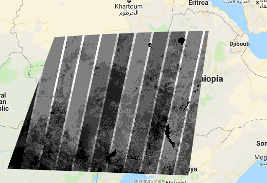

# [WUR Geoscripting](https://geoscripting-wur.github.io/) 

# Week 3, Lesson 12: Google Earth Engine

Good morning! Today we will start working with Google Earth Engine.
If you do not have an active account yet, [register an account now](https://signup.earthengine.google.com/#!/). Hopefully it will be activated soon. If it doesn't work out, ask someone to share a repository with you, that should grant you an account.

### Today's learning objectives

We will check out Google's Earth Engine. First what it is, but most importantly what we can do with it.

## Google Earth Engine
You might wonder why Google chose the same name as their other [Google Earth](https://earth.google.com/web/). It's no coincidence. Google Earth Engine is less of a name, and more of a description. It represents the collection of tools that were built to develop and ultimately power Google Earth. Google Earth Engine is Google's Earth Engine, but also Google Earth's engine.

On top of the "Engine", GEE has 2 interfaces for users, through its Javascript and Python API. Even though they serve 2 different programming languages, they are almost interchangeable. The only major difference between the 2 is that Google built a nice [IDE](https://en.wikipedia.org/wiki/Integrated_development_environment) webapp, called the Code Editor, which can be used to interact with GEE, but only using Javascript. This is the most beginner friendly way to interact with Google Earth Engine, so that's what we'll focus on as well. If you are confident in your skills, feel free to explore interacting with GEE through Python as well.

If you want to know more about what is Google Earth Engine, please [read the paper straight from the horse's mouth](https://www.sciencedirect.com/science/article/pii/S0034425717302900). For those of you more inclined towards dramatic arts, feel free to [watch (later!) the recent Netflix' take on it](https://www.netflix.com/title/81074012) as well.

Lastly, Google Earth Engine contains almost everything you could wish in terms of easy access to free satellite data through its [Earth Engine Data Catalog] (https://developers.google.com/earth-engine/datasets/catalog)

## Let's get our hands dirty

Google already developed free and comprehensive [guides for its Earth Engine](https://developers.google.com/earth-engine/guides), so we'll make extensive use of those. Although ideally you would go through all their tutorials to become an expert, we believe the following are enough to get you to the necessary level for today's evening exercise and to self-develop afterwards.

Read the following guides. Feel free to copy-paste the code examples in the code-editor, but please remember that you don't need yet to perfectly understand each shown line of code.

1. [Javascript Quickstart](https://developers.google.com/earth-engine/guides/getstarted)
2. [Coding Best Practices specific to Google Earth Engine](https://developers.google.com/earth-engine/guides/best_practices)
3. [Debugging Google Earth Engine code](https://developers.google.com/earth-engine/guides/debugging)

Follow only the first 2 tutorials (linked below) on the [Tutorials page](https://developers.google.com/earth-engine/tutorials/tutorials). To properly go through these tutorials, differently from the above guides, you have to run, and try to understand the code. There will probably still be some confusing lines of code left, but that's fine as long as you gave it a try. Learning is a process, not a task. Please note that each tutorial is comprised of multiple sections, so you'll have to click on the next section link at the bottom of the Introduction pages of the 2 tutorials linked below.

1. [Introduction to JavaScript for Earth Engine (3 sections)](https://developers.google.com/earth-engine/tutorials/tutorial_js_01)
2. [Introduction to the Earth Engine JavaScript API (7 sections)](https://developers.google.com/earth-engine/tutorials/tutorial_api_01)

Only if you still have time, going through the [Concepts Guide](https://developers.google.com/earth-engine/guides/concepts_overview) might be useful to understand why is Google Earth Engine so awkwardly different from everything else you programmed so far.

[Enjoy your lunch!](https://www.youtube.com/watch?v=Tas0c4e_E0M&list=PLivRXhCUgrZpCR3iSByLYdd_VwFv-3mfs&index=2)
(If this message takes you by surprise, click [here](https://developers.google.com/earth-engine/tutorials/tutorial_forest_01))

<!--
## What does Google Earth Engine do?

Google Earth Engine is a cloud-based platform for planetary-scale environmental data analysis. 
The main components of Earth Engine are:

- Datasets: A petabyte-scale archive of publicly available remotely sensed imagery (such as Landsat, Sentinel and Modis) and other data (e.g. elevation data). [Explore categories of data in the archive or browse and search datasets](https://earthengine.google.com/datasets/). 
- Compute power: Google’s computational infrastructure optimized for parallel processing of geospatial data. Learn more from [Gorelick et al. (2017)](http://www.sciencedirect.com/science/article/pii/S0034425717302900).
- APIs: APIs for JavaScript and Python ([see GitHub](https://github.com/google/earthengine-api)) for making requests to the Earth Engine servers. These docs focus on JavaScript; ([Guide for JavaScript API](https://developers.google.com/earth-engine/getstarted)). For Python, see the [Python install guide](https://developers.google.com/earth-engine/python_install.html) and the Python examples in the Earth Engine GitHub repository.
- Code Editor: An online Integrated Development Environment (IDE) for rapid prototyping and visualization of complex spatial analyses using the JavaScript API [Code Editor docs](https://developers.google.com/earth-engine/playground.html).

## Google Earth Engine: Code Editor in JavaScript
Today you will learn about Google Earth Engine by going through 9 tutorials made by Google. In the morning you will work on these tutorials. Have fun working in the cloud!

1. [Get familiar with basic JavaScript syntax](https://developers.google.com/earth-engine/tutorial_js_01)
2. [Get familiar with advanced JavaScript syntax](https://developers.google.com/earth-engine/tutorial_js_02)
3. [Get familiar with the Code Editor](https://developers.google.com/earth-engine/playground)
4. [Visualizing Images and Image Bands](https://developers.google.com/earth-engine/tutorial_api_02)
5. [Computations using Images](https://developers.google.com/earth-engine/tutorial_api_03)
6. [Image Collections](https://developers.google.com/earth-engine/tutorial_api_04)
7. [Compositing, Masking, and Mosaicking](https://developers.google.com/earth-engine/tutorial_api_05)
8. [NDVI, Mapping a Function over a Collection, Quality Mosaicking](https://developers.google.com/earth-engine/tutorial_api_06)
9. [Exporting Charts and Images](https://developers.google.com/earth-engine/tutorial_api_07)

```{block2, type="alert alert-info"}
ProTip: at almost any point you can use ``.aside(print)`` for debugging purposes. Come back to this [Debugging guide](https://developers.google.com/earth-engine/debugging) when in need
```
Google Earth Engine is a nice platform for processing and visualization. Even though raw data can be downloaded, such an attempt would defeat its intended goal of uploading the code next to the data instead of downloading data next to the code.

```{block, type="alert alert-success"}
> **Question 1**: Is the code on the online editor reproducible for other users?
```

If you finished these tutorials and want to do more advanced stuff with the Code Editor you can have a look at [other tutorials made by universities](https://developers.google.com/earth-engine/edu) or at more [advanced guides of Earth Engine](https://developers.google.com/earth-engine/) (you can find the guides in the left pane) about the Image (e.g. [gradients](https://developers.google.com/earth-engine/image_gradients), [edge detection](https://developers.google.com/earth-engine/image_edges), [object detection](https://developers.google.com/earth-engine/image_objects)), ImageCollection, Geometry & Features, Reducer, Join, Chart ([e.g. time series analysis](https://developers.google.com/earth-engine/charts_image_series_by_region)), Array, User Interfaces, Specialized Algorithms, Asset Management, Custom Applications and Earth Engine setup.

## Google Earth Engine: Python API
Although Earth Engine focuses on using JavaScript in the online Earth Engine Code Editor, an Earth Engine Python module was developed. The module allows you to connect via an API to to the Earth Engine servers. 

This [presentation](https://docs.google.com/presentation/d/1MVVeyCdm-FrMVRPop6wB3iyd85TAlwB-F9ygTQZ8S1w/pub?slide=id.g1e419debf0_1_205) on the Earth Engine user summit explains more about the Python API. 

Earth Engine normally uses Python 2.7. However Earth Engine is trying to make code compatible for both Python 2 and Python 3. Since Python 3 is the future, we will use Python 3. Your Google account needs to be accepted to authenticate your local Earth Engine Python module. So we need to setup the Python environment and get authenticated:

```{r, engine = 'bash', eval = FALSE}
# Create Conda environment
conda create -n ee_py3 -c conda-forge python=3 google-api-python-client pyCrypto spyder jupyter

source activate ee_py3

# Ensure that a crypto library is available
python -c "from oauth2client import crypt"

# Install earthengine-api
pip install earthengine-api

# Authenticate earth engine
earthengine authenticate
# Follow procedure to authenticate and paste the access token in your terminal

# Check if earth engine has been installed
python -c "import ee; ee.Initialize()"
# If you don't get an error, you are good to go
```

After setting up the Python environment, you can start a jupyter notebook or spyder and run some Python code.

```{r, engine = 'python', eval = FALSE}
# Import the Earth Engine Python Package
import ee

# Initialize the Earth Engine object, using the authentication credentials.
ee.Initialize()

# Print the information for an image asset.
image = ee.Image('srtm90_v4')
print(image.getInfo())
```

Now we want a Python script that shows a time series of Landsat 8 imagery. 

```{r, engine = 'python', eval = FALSE}
import ee
from ee import batch

## Initialize connection to server
ee.Initialize()

## Define your image collection 
collection = ee.ImageCollection('LANDSAT/LC8_L1T_TOA')

## Define time range
collection_time = collection.filterDate('2013-04-11', '2018-01-01') #YYYY-MM-DD

## Select location based on location of tile
path = collection_time.filter(ee.Filter.eq('WRS_PATH', 198))
pathrow = path.filter(ee.Filter.eq('WRS_ROW', 24))
# or via geographical location:
#point_geom = ee.Geometry.Point(5, 52) #longitude, latitude
#pathrow = collection_time.filterBounds(point_geom)

## Select imagery with less then 5% of image covered by clouds
clouds = pathrow.filter(ee.Filter.lt('CLOUD_COVER', 5))

## Select bands
bands = clouds.select(['B4', 'B3', 'B2'])

## Make 8 bit data
def convertBit(image):
    return image.multiply(512).uint8()  

## Convert bands to output video  
outputVideo = bands.map(convertBit)

print("Starting to create a video")

## Export video to Google Drive
out = batch.Export.video.toDrive(outputVideo, description='Netherlands_video_region_L8_time', dimensions = 720, framesPerSecond = 2, region=([5.588144,51.993435], [5.727906, 51.993435],[5.727906, 51.944356],[5.588144, 51.944356]), maxFrames=10000)

## Process the image
process = batch.Task.start(out)

print("Process sent to cloud")
```

To explain what is going on in the script: an ImageCollection is created and queried by filtering on date, location, clouds, bands. The ImageCollection object holds the information of the query and is sent to the Google Earth Engine server. The Google Earth Engine server then performs the task of gathering the data, making the imagery into a video and then exporting it to your Google Drive.

There are some more [advanced Python scripts](https://github.com/tylere/AGU2017/tree/master/notebooks) made by the Google Earth Engine developers that work with `bqplot` and `ipyleaflet`. If you want you can have a look at those too.

```{r, engine = 'bash', eval = FALSE}
# Install bqplot from conda-forge channel and ipyleaflet with pip
source activate ee_py3
conda install -c conda-forge bqplot
pip install ipyleaflet
jupyter nbextension enable --py --sys-prefix ipyleaflet
```

<!--

# Exercise 13 : Blue skies

In remote sensing clouds are our arch enemies. You probably heard this a lot, and you'll hear it again from everyone working with satellite imagery.

But how big of a problem are clouds, cloud shadows, or other obstructions? Are they as bad as people say?

Have fun figuring it out using the [online code editor of Google Earth Engine](https://code.earthengine.google.com/).

## A bit of organization first

1. Create a new repository, named like your team, using the red new button on your left in the [GEE code editor](https://code.earthengine.google.com/)

2. Create a new file in that repository and name it *Assignment13*. At the beginning of this file write your names as comments.

3. Either now, or after you're done with your assignment, share your newly created repository with andrei.mirt@gmail.com

## Requirements

Display a map for an area of your choice in which each pixel represents the number of clear Landsat 8 (not clouded) observations at that location for the year 2018. The final map should look somewhat similar to the picture below:



## Hints

- It is really important to [Get familiar with the Geometry tools of the Code Editor](https://developers.google.com/earth-engine/playground), in order to be able to choose a geometry of interest.
- The code editor is powerful because you can [visualize images](https://developers.google.com/earth-engine/tutorial_api_02) immediately on the Map section.
- It is important to think what [Image Collections and bands](https://developers.google.com/earth-engine/tutorial_api_04) you need to filter on your dates.

The quality mask is stored in the pixel_qa band as a bitmask. You can use the [Landsat 8 Surface Reflectance Code Product Guide](https://landsat.usgs.gov/sites/default/files/documents/lasrc_product_guide.pdf) to remap the clear pixel_qa values to 1. 386 is a good value for clear observations.


```{block, type="alert alert-success"}
> **Question 2**:  Can you find a better value for clear observations than 386, could you use these together?
```

## More hints

-Are there any interesting patterns on the total number of observations? Can you explain all these patterns? The answer to this question on [StackExchange](https://gis.stackexchange.com/questions/280156/mosaicking-a-image-collection-by-date-day-in-google-earth-engine) might come in handy.


```{block2, type="btn btn-success"}
SuperHint
```
```{block2, type="alert alert-success"}
You should probably first **count** all valid observations and then **mask** your way through **each** band towards the **total** number of clear observations.
```

# Bonus

- Do the same for sentinel 2. Plot the map in parallel linked panels.

Still have some time left? Work on the visualization parameters.

# Submission

Ask the team checking your script for their Google Earth Engine account (gmail address), and don't forget to share your repository with them and with andrei.mirt@gmail.com

In order to assess the exercise, consider the following tasks:

- Task 1: The script displays a map somehow related to the input data
- Task 2: The script displays the map that shows the number of clear observations, but some values are unnecessarily repeated
- Task 3: The script displays the correct map that shows the number of clear observations, without repeating unnecessary values

Further you can explore how you can use Google Earth Engine for your project or try to do some of the more [advanced guides](https://developers.google.com/earth-engine/)(scroll through the left pane).

Sunny places make good holidays. After all this work, you can use the map you just created to search for your next holiday destination, while listening to an [Irving Berlin classic](https://www.youtube.com/watch?v=64rulm3CFhg).

-->

# References and more info

Most of the information on Google Earth Engine in this tutorial comes directly from [Google](https://developers.google.com/earth-engine/) and from universities, whom developed [tutorials](https://developers.google.com/earth-engine/edu) for students to work with Google Earth Engine.

- [Earth Engine developers forum](https://groups.google.com/forum/#!forum/google-earth-engine-developers)
- Discussing black box of cloud computation by Jordi Inglada ([blog1](https://jordiinglada.net/wp/2016/05/12/is-google-earth-engine-evil-2/))([blog2](https://jordiinglada.net/wp/2016/05/23/sympathy-for-the-evil-lets-help-improve-google-earth-engine-2/))
